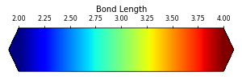
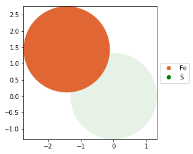

```python
from ase.build import bulk
from jsonextended import edict
from ipyatom import repeat_cell
from ipyatom import render_ivol
from ipyatom import bonds
from ipyatom import plot_mpl
```


```python
atoms = bulk("Fe").repeat((2,1,1))
atoms
```


    Atoms(symbols='Fe2', pbc=True, cell=[[-2.87, 2.87, 2.87], [1.435, -1.435, 1.435], [1.435, 1.435, -1.435]])


```python
vstruct = repeat_cell.atoms_to_dict(atoms)
vstruct["elements"][0]["sites"][0]["label"] = "S"
vstruct = repeat_cell.change_site_variable(
    vstruct, {"color_fill": "green"}, {"label": "S"})
edict.pprint(vstruct)
```

    elements:
      - bonds:    []
        cell_vectors:
          a: [-2.87, 2.87, 2.87]
          b: [1.435, -1.435, 1.435]
          c: [1.435, 1.435, -1.435]
        centre:   [0.0, 1.435, 1.4349999999999998]
        color_bbox: black
        name:
        sites:
          - anum:        26
            ccoord:      [0.0, 0.0, 0.0]
            cell:        [0, 0, 0]
            color_fill:  green
            color_outline: None
            label:       S
            radius:      1.32
            transparency: 1
          - anum:        26
            ccoord:      [-1.435, 1.435, 1.435]
            cell:        [0, 0, 0]
            color_fill:  #e06633
            color_outline: None
            label:       Fe
            radius:      1.32
            transparency: 1
        transforms: []
        type:     repeat_cell
    transforms: []


```python
new_struct, fig, controls = render_ivol.create_ivol(vstruct)
render_ivol.ipy_style(fig)
```


    A Jupyter Widget


```python
vstruct2 = bonds.add_bonds(vstruct, "Fe", "S", 2.5)
edict.pprint(vstruct2)
```

    elements:
      - bonds:
          - cmap_name:      jet
            color_by_dist:  False
            coord_label:    S
            drange:         (0, 10)
            include_periodic: True
            label:          Fe
            max_dist:       2.5
            radius:         0.1
        cell_vectors:
          a: [-2.87, 2.87, 2.87]
          b: [1.435, -1.435, 1.435]
          c: [1.435, 1.435, -1.435]
        centre:   [0.0, 1.435, 1.4349999999999998]
        color_bbox: black
        name:
        sites:
          - anum:        26
            ccoord:      [0.0, 0.0, 0.0]
            cell:        [0, 0, 0]
            color_fill:  green
            color_outline: None
            label:       S
            radius:      1.32
            transparency: 1
          - anum:        26
            ccoord:      [-1.435, 1.435, 1.435]
            cell:        [0, 0, 0]
            color_fill:  #e06633
            color_outline: None
            label:       Fe
            radius:      1.32
            transparency: 1
        transforms: []
        type:     repeat_cell
    transforms: []


```python
new_struct, fig, controls = render_ivol.create_ivol(vstruct2)
render_ivol.ipy_style(fig)
```


    A Jupyter Widget


```python
vstruct3 = bonds.add_bonds(vstruct, "Fe", "S", 2.5, color_by_dist=True, drange=(2,4))
edict.pprint(vstruct3)
```

    elements:
      - bonds:
          - cmap_name:      jet
            color_by_dist:  True
            coord_label:    S
            drange:         (2, 4)
            include_periodic: True
            label:          Fe
            max_dist:       2.5
            radius:         0.1
        cell_vectors:
          a: [-2.87, 2.87, 2.87]
          b: [1.435, -1.435, 1.435]
          c: [1.435, 1.435, -1.435]
        centre:   [0.0, 1.435, 1.4349999999999998]
        color_bbox: black
        name:
        sites:
          - anum:        26
            ccoord:      [0.0, 0.0, 0.0]
            cell:        [0, 0, 0]
            color_fill:  green
            color_outline: None
            label:       S
            radius:      1.32
            transparency: 1
          - anum:        26
            ccoord:      [-1.435, 1.435, 1.435]
            cell:        [0, 0, 0]
            color_fill:  #e06633
            color_outline: None
            label:       Fe
            radius:      1.32
            transparency: 1
        transforms: []
        type:     repeat_cell
    transforms: []


```python
new_struct, fig, controls = render_ivol.create_ivol(vstruct3)
render_ivol.ipy_style(fig)
```


    A Jupyter Widget


```python
%matplotlib inline
import matplotlib.pyplot as plt
fig, ax = plt.subplots(1)
plot_mpl.create_colorbar(ax, (2, 4), "jet", "Bond Length")
fig.set_size_inches((5,1))
```





```python
plot_mpl.plot_atoms_top(vstruct)
```


    (<matplotlib.axes._subplots.AxesSubplot at 0x118a279e8>,
     {'Fe': <matplotlib.lines.Line2D at 0x118c465c0>,
      'S': <matplotlib.lines.Line2D at 0x118c37a90>})




